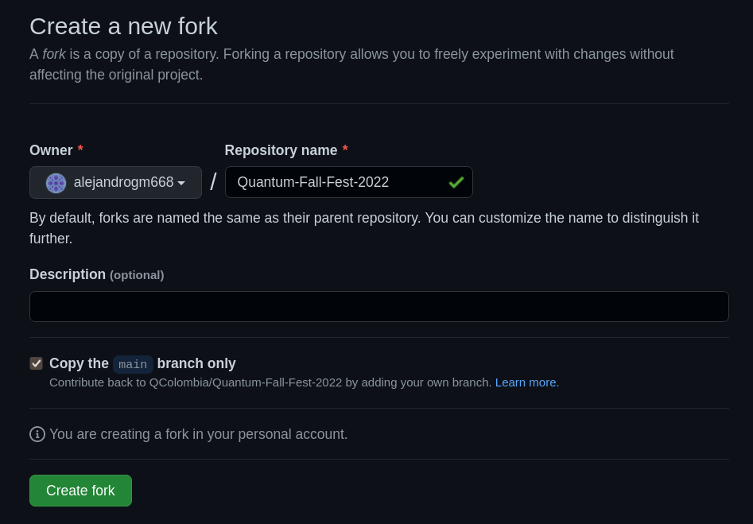

# QColombia Quantum Fall Fest

## Bienvenido/a

Estamos muy emocionados de tenerte en nuestro evento. Antes de dar información específica nos gustaría presentamos, somos QColombia, una organización cuyo objetivo es difundir el desarrollo de tecnologías cuánticas en Colombia, que hace parte de QWorld (https://qworld.net/qcolombia/). QColombia proporciona recursos para que los estudiantes y personas interesadas en computación cuántica se familiaricen con los conceptos fundamentales. Si quieres unirte al grupo síguenos en nuestra cuenta de Instagram [@qc.colombia](https://www.instagram.com/qc.colombia/)

El Qiskit Fall Fest (https://medium.com/qiskit/introducing-the-qiskit-fall-fest-feb8456b557) es un conjunto de eventos de computación cuántica que ocurren en universidades, institutos, países alrededor del mundo. Cada Fall Fest se organiza por un grupo de estudiantes de cada región, en nuestro caso, QColombia es el organizador. Para el desarrollo del evento, se cuenta con el apoyo del equipo completo de **IBM Quantum**. 

El Quantum Fall Fest de QColombia consiste en un **workshop** de una semana, desde el **10 de Octubre** hasta el **14 de Octubre**, en donde contaremos con la participación de expertos provenientes de la industria: IBM, Google Quantum, Xanadu, Entropica, Zapata. Luego, tendremos un **Hackathon** entre el **14 de Octubre** y el **17 de Octubre**, que consistirá en formar grupos de 5 personas, cuya misión es proponer un proyecto en el que se pueda usar computación cuántica y desarrollarlo tanto como se pueda utilizando las herramientas vistas en el wokshop. La idea del proyecto puede ser tan loca como la imaginación de los participantes lo permita. 

--------------------------------
## Registro Oficial
Para registrarte, ve al siguiente [link](https://airtable.com/shrczNjv28rPqUn0d)

## Detalles del workshop
* 10 Octubre - Google

Cirq: Programming google's quantum processors. 
**Presentado por:** Alejandro Grajales Dau
* 11 Octubre - IBM

Retos de investigar en técnicas de aprendizaje de máquina cuántico.
**Presentado por:** Daniel Sierra Sosa
* 12 Octubre - Entropica

OpenQAOA: Quantum Optimization for Dummies. 
**Presentado por:** Shahidee Nur
* 13 Octubre - Xanadu

Quantum Machine Learning con PennyLane.
**Presentado por:** Catalina Albornoz
* 14 Octubre - Zapata Computing

Introduction to quantum machine learning research at scale.
**Presentado por:** Vladimir Vargas

## Detalles del Hackathon

* Para registrar al equipo, **solo uno** de los miembros debe llenar el siguiente formulario: 
* El hackathon consiste en una *idea libre*, es decir, cada grupo tiene la libertad de pensar en un problema (proyecto) donde pueda usarse computación cuántica, desarrollarlo tanto como se pueda en el tiempo del Hackathon y enviarlo. 

### Sobre el proyecto
* El proyecto desarrollado por el grupo se debe entregar como un conjunto de archivos o cuadernos de python que sean necesarios para su desarrollo. **No** es obligatorio pero pueden basarse en el formato de la carpeta [Proyecto](https://github.com/QColombia/Quantum-Fall-Fest-2022/tree/main/Proyecto) 
* Deberá existir un notebook principal que contenga como mínimo los nombres de los participantes, una descripción del proyecto y la implementación en código de la idea.

### Modo de entrega
* **Paso 1** Hacer fork a [este repositorio](https://github.com/QColombia/Quantum-Fall-Fest-2022) 

* **Paso 2** Click en Crear fork

* **Paso 3** Dentro del fork, modificar la carpeta *Proyecto* a su conveniencia. Por ejemplo, modificando el README o borrando los archivos existentes y subiendo los del proyecto.

### Modo alternativo de entrega
* **Solo una** persona del equipo puede enviar el proyecto al correo: alejandro.cadavid@correounivalle.edu.co

--------------------------------

 

## Adicional

  
### [Código de Conducta de Qiskit Events](https://github.com/Qiskit/qiskit/blob/master/CODE_OF_CONDUCT.md)
